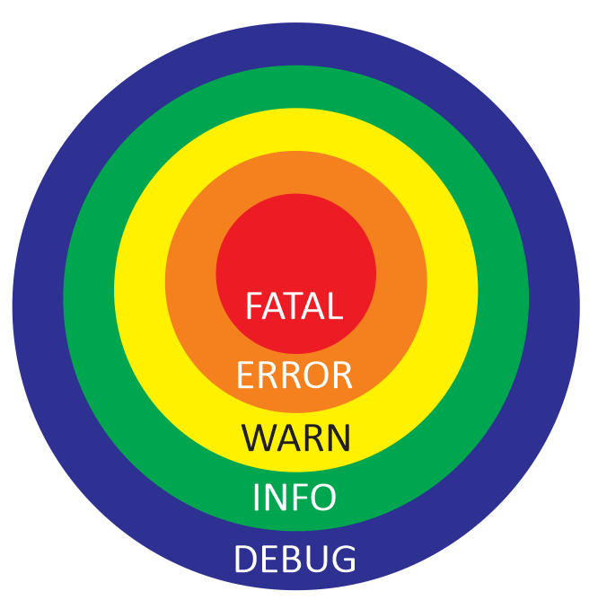
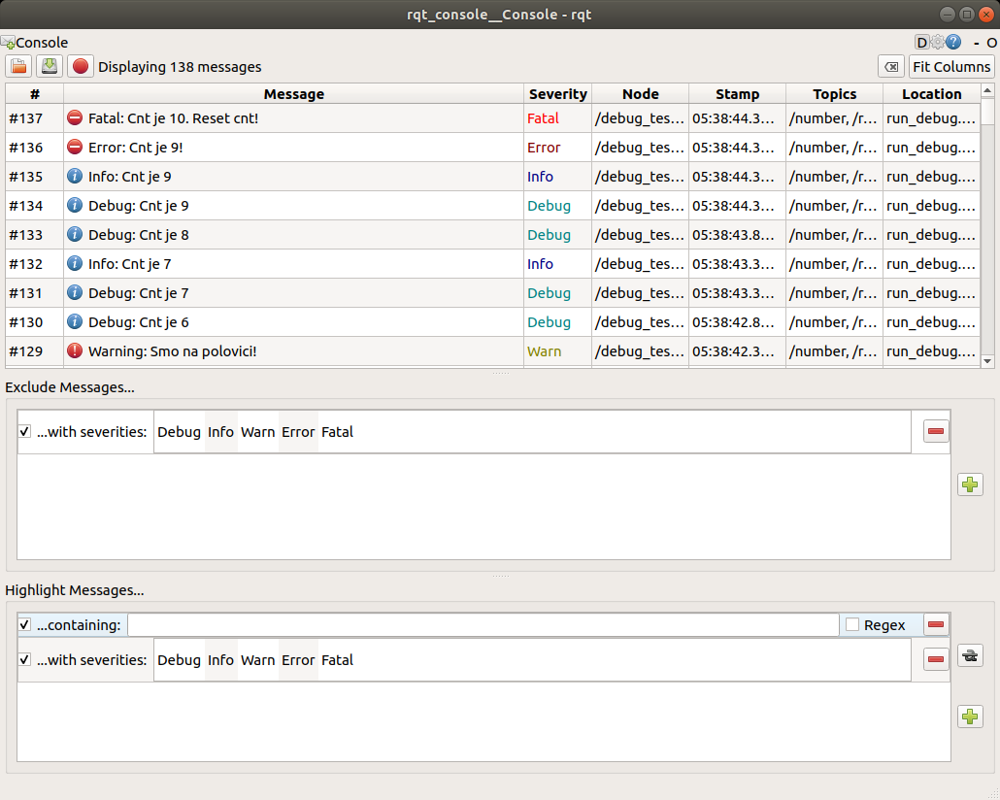
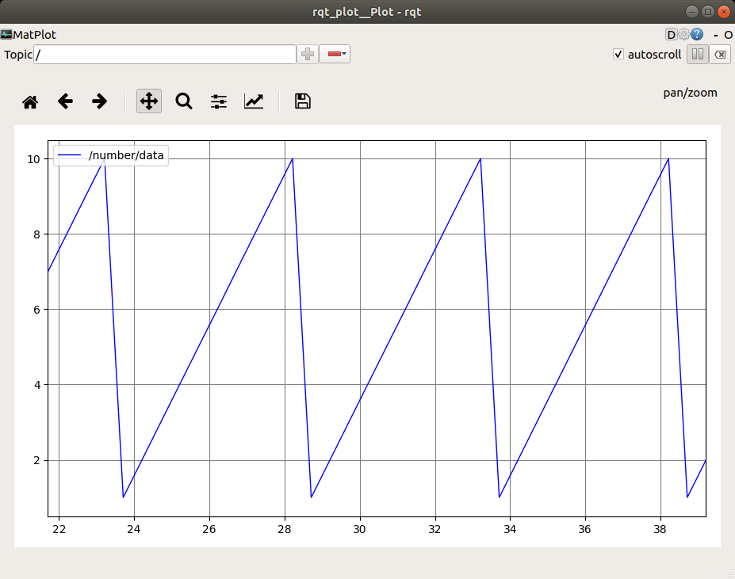
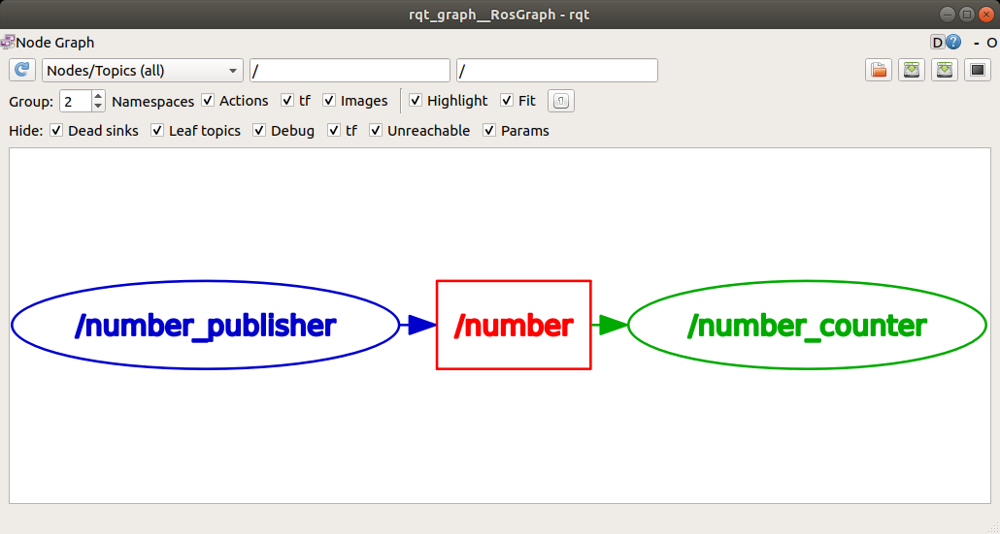

# ROS Debug tools

## Logging
5 logging levels:

- DEBUG
  - INFO
    - WARN
      - ERROR
        - FATAL



Code example
```python linenums="1"
rospy.init_node('log_demo', log_level=rospy.DEBUG)

while not rospy.is_shutdown():
  rospy.logdebug("Debug msg")
  rospy.loginfo("Info msg")
  rospy.logwarn("Warning msg")
  rospy.logerr("Error msg" )
  rospy.logfatal("Fatal msg")
```

## rqt_console

GUI for log messages.

```
rqt_console
```



## rqt_plot

Graphical plot of signals from selected topics.

```
rqt_plot
```



## rqt_graph

Shows connection between nodes in the system.

```
rqt_graph
```



## RViz

RViz visually represents data from topics. 

RViz is NOT a simulation, it represents the current state of the robot

```
rosrun rviz rviz
```

