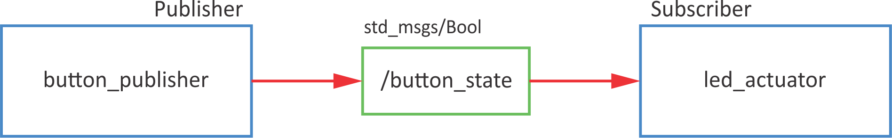
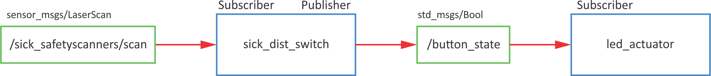
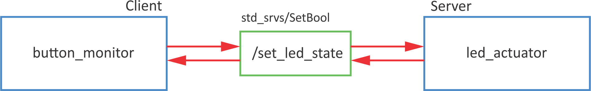
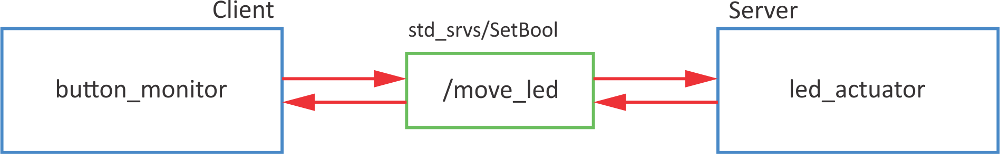
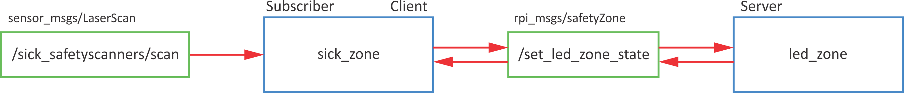
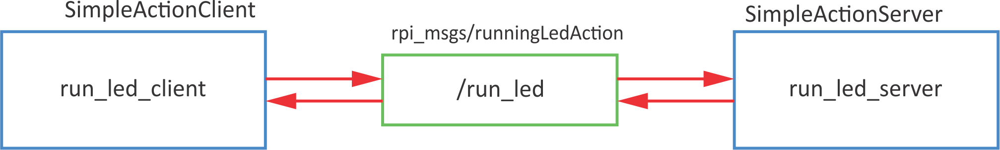
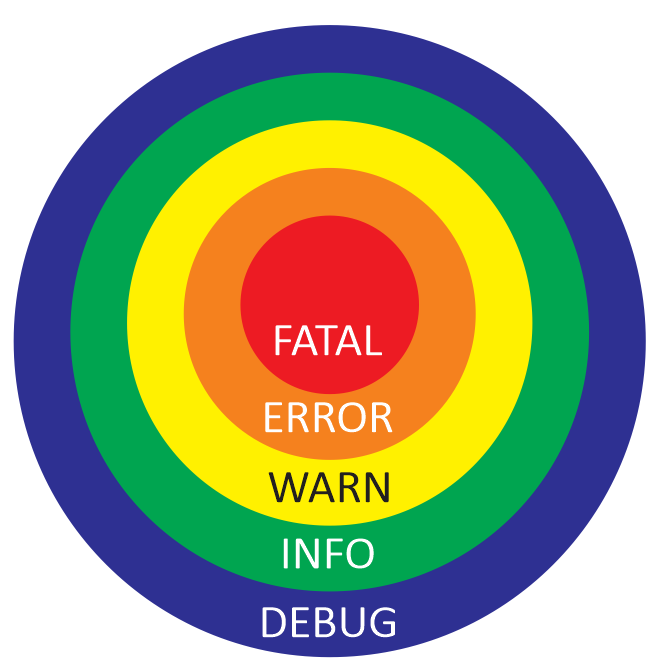
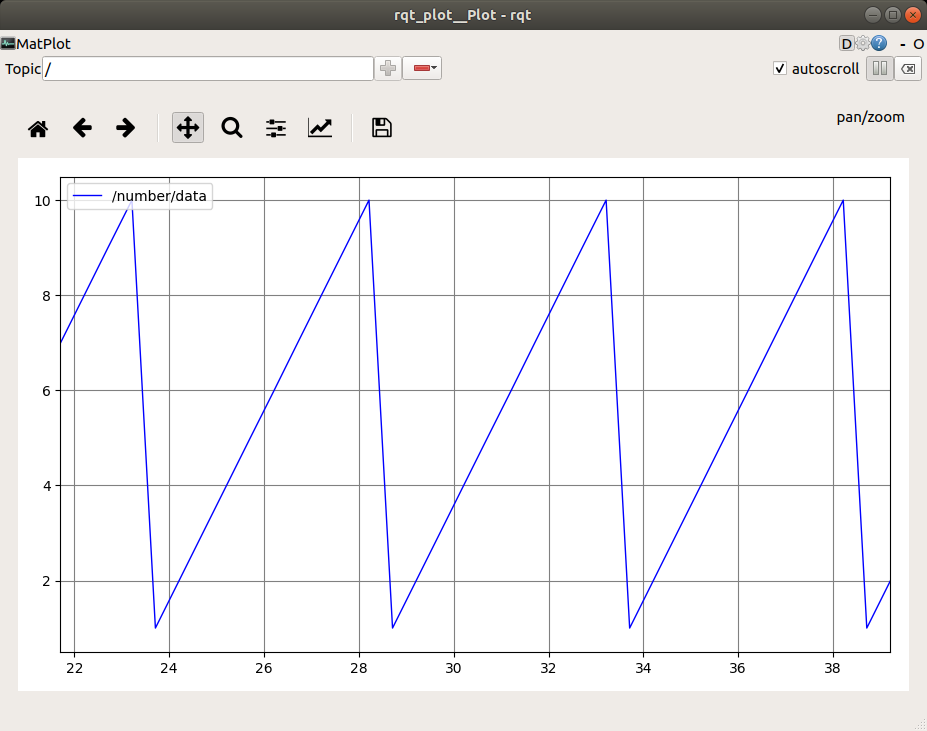
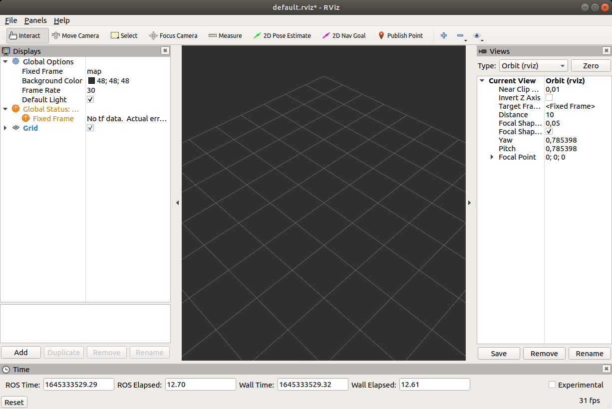

# Introduction to ROS

Welcome to the ROS FE workshop. In this part of the workshop you will learn the fundamentals of ROS.

## Why ROS?

ROS is an open-source, meta-operating system for your robot. It provides the services you would expect from an operating system, including hardware abstraction, low-level device control, implementation of commonly-used functionality, message-passing between processes, and package management. It also provides tools and libraries for obtaining, building, writing, and running code across multiple computers. 

ROS has three levels of concepts: the Filesystem level, the Computation Graph level, and the Community level.

#### ROS Filesystem Level

The basic unit for software code organization in ROS is a package. It can contain code for processes, liberaries, datasets, configuration files and custom communication types definitions. Packages can be sensibly grouped into metapackages. Each package contains a package manifest (package.xml) that provides the metadata about the package.

#### ROS Computation Graph Level

In ROS, processes run as nodes in a peer-to-peer network processing data together. This network is called ROS Computation Graph and it is supported by the name registration and lookup services of the ROS Master, by the parameter storing and serving services of the Parameter Server, and by the ROS logging mechanism. ROS nodes communicate by excanging data using messages in communication models called topics, services and actions.

#### ROS Community Level

There is a large number of ROS developers and robotic systems developers using ROS worldwide. Separate communities can exchange software and knowledge using ROS distributions, code repositories, the ROS Wiki and ROS Answers forums, blog and mailing lists. To get the participants of this course acquainted with the availabe resources, reading through some of the ROS Wiki topics will be encouraged by providing links to the ROS Wiki contents.

## ROS setup

### roscore

- takes care of communicaiton between different ROS functionalities
- it can run only one at once
- connects different ROS system into one ROS network

```python
roscore
```

### catkin workspace

CATKIN is an official build system for ROS

```
cd
mkdir catkin_ws
cd catkin_ws
mkdir src
catkin_make
```

Alternative is to use `catkin build` (beforehand you need to remove devel and build folders).

Conect console with ROS variables
```
cd devel
source setup.bash
```

To do this automatically when the console is opened, add to `bashrc.sh`
```
echo "source ~/catkin_ws/devel/setup.bash" >> ~/.bashrc
source ~/.bashrc
```

## Packages

Packages are independent units, that can be re-used.

### New package

Go to `catkin_ws/src/` folder.

Basic syntax:
```
catkin_create_pkg <package_name> [depend1] [depend2] [depend3]
```

Create new package `rpi_test`:

```
cd ~/catkin_ws/src
catkin_create_pkg rpi_test rospy std_msgs
cd ..
catkin_make
```

## Node
Nodes are processes:

- used for calculations,
- that run inside robotic application,
- grouped into packages,
- that communicate with each other (topics, servers, actions, parameter servers). 

Why to use nodes:

- reduce code complexity,
- the code is more error-resistant,
- use of different programming languages.

### New node

Nodes are scripts that are located inside `scripts` folder.
```
roscd rpi_test
mkdir scripts
cd scripts
```
Create new script `my_first_node.py`:
```
touch my_first_node.py
```

Change the access permissions of the file to executable:
```
chmod +x my_first_node.py
```

Open script with Visual Studio Code:
```
code my_first_node.py
```

The minimal working example for node:

```python linenums="1" title="my_fist_node.py"
#!/usr/bin/env python

import rospy

if __name__ == '__main__':
  rospy.init_node('my_first_python_node')
  rospy.loginfo('This node has been started.')
  rospy.sleep(1)
  print('Exit now')
```

Only one node with specific name can be run at a time. If you want to run more instances of the same node, change:
```python linenums="6"
  rospy.init_node('my_first_python_node', anonymous=True)
```

To run, write
```
python my_first_node.py
```

### New node - class

```python linenums="1" title="my_fist_node_class.py"
#!/usr/bin/env python

import rospy

class hello_world():
    
  def __init__(self):
    # init variables
    self.delay = 5
    self.ctrl_c = False
    rospy.on_shutdown(self.shutdownhook)
        
  def shutdownhook(self):
    # works better than the rospy.is_shutdown()
    # this code is run at ctrl + c
    rospy.loginfo('This node has been terminated.')
    self.ctrl_c = True
  
  def test_node(self): 
    rospy.loginfo('This node has been started.')
    rospy.sleep(self.delay)
    print('Exit now')
            
if __name__ == '__main__':
  # initialise node
  rospy.init_node('my_first_python_node')
  # initialise class
  first_node = hello_world()
  try:
    first_node.test_node()
  except rospy.ROSInterruptException:
    pass
```


### DEBUG

- `rosrun <pkg name> <node name>` - run specific node
- `rosnode list` - list of all active nodes
- `rosnode info <node name>` - information about hte node
- `rosnode kill <node name>` - shut down node
- `rosnode ping <node name>` - ping node (check, if it is working)

## Examples for Raspberry Pi

Download examples on RaspberryPi.

Go to `src` directory:
```bash
roscd
cd ..
cd src
```

Clone from GitHub:
```bash
git clone https://github.com/ROS-FE/rpi_ros_examples.git .
```

Build the packages:
```bash
roscd
cd ..
catkin_make
```


## Topics

Topic is:

- a communication channel through which nodes exchange messages
- one-way messaging (publisher> subscriber)
- anonymous
- topic has its own message type ([list of standars message types](http://wiki.ros.org/std_msgs))
- ROS master takes care of the proper publisher/subscriber connection
- each node can have multiple publishers/subscribers for different topics

### Example

Turn on LED on button press.



#### Publisher

Syntax for publisher:
```python
pub = rospy.Publisher('/topic_name', msg_type, queue_size=10)
```

Example code:

```python linenums="1" title="button_publisher.py"
#!/usr/bin/env python

import rospy
import RPi.GPIO as GPIO
from std_msgs.msg import Bool

# buttons GPIO pins 
#   button 1 - gpio 11
#   button 2 - gpio 12

class rpi_button():
    
    def __init__(self):
        # init variables
        self.BUTTON_GPIO = 11
        # set GPIO kot BCM
        GPIO.setmode(GPIO.BCM)
        # set button IO as input
        GPIO.setup(self.BUTTON_GPIO, GPIO.IN)
        # set loop frequency to 10 Hz
        self.rate = rospy.Rate(10)
   
        # define publisher
        # rospy.Publisher("topic_name", varType, queue_size)
        self.pub = rospy.Publisher('/button_state', Bool, queue_size=10)

        self.ctrl_c = False
        rospy.on_shutdown(self.shutdownhook)

    def read_button(self):
        while not self.ctrl_c:
            #  read GPIO pin
            gpio_state = GPIO.input(self.BUTTON_GPIO)
            # define msg as Bool variable
            self.msg = Bool()
            # msg has a data "data"
            self.msg.data = gpio_state
            # send msg
            self.publish_once()
    
    def publish_once(self):
        """
        This is because publishing in topics sometimes fails the first time you publish.
        In continuous publishing systems, this is no big deal, but in systems that publish only
        once, it IS very important.
        """
        while not self.ctrl_c:
            connections = self.pub.get_num_connections()
            if connections > 0:
                self.pub.publish(self.msg)
                #rospy.loginfo("Msg Published")
                break
            else:
                self.rate.sleep()
       
    def shutdownhook(self):
        # works better than the rospy.is_shutdown()
        # this code is run at ctrl + c

        # clear all GPIO settings
        GPIO.cleanup()
        self.ctrl_c = True
            
if __name__ == '__main__':
    # initialise node
    rospy.init_node('button_state_publisher', anonymous=True)

    # initialise class
    btn = rpi_button()
    try:
        btn.read_button()
    except rospy.ROSInterruptException:
        pass
```

To test the code run
```
rosrun rpi_feros button_publisher.py
```
check the list of topics (look for `/button_state`)
```
rostopic list
```
Then listen to that topic
```
rostopic echo /button_state -c
```
and press the button on RaspberryPi.

#### Subscriber

Syntax for subscriber:
```python
sub = rospy.Subscriber('/topic_name', msg_type, callback_fcn)
```
Example code:
```python linenums="1" title="led_actuator.py"
#!/usr/bin/env python

import rospy
from std_msgs.msg import Bool
import RPi.GPIO as GPIO

# GPIO za LED:
#   Green 1 - GPIO 2
#   Green 2 - GPIO 3
#   Yellow 1 - GPIO 4
#   Yellow 2 - GPIO 5
#   Red 1 - GPIO 6
#   Red 2 - GPIO 7

class rpi_led():
    
    def __init__(self):
        # init variables
        self.LED_GPIO = 7
        # set GPIO kot BCM
        GPIO.setmode(GPIO.BCM)
        # set all leds
        for ii in range(2,8):
            # set IO as outputs
            GPIO.setup(ii,GPIO.OUT)
        
        # define subscriber
        # rospy.Subscriber('topic_name', varType, callback)
        self.sub = rospy.Subscriber('/button_state', Bool, self.button_state_callback)

        self.ctrl_c = False
        rospy.on_shutdown(self.shutdownhook)

    def button_state_callback(self, msg):
        # the code that is executed when data is received
        # turn on LED
        GPIO.output(self.LED_GPIO, msg.data)

    def resetLed(self):
        # reset all leds
        for ii in range(2,8):
            # turn off all leds
            GPIO.output(ii,False)
        
    def shutdownhook(self):
        # works better than the rospy.is_shutdown()
        # this code is run at ctrl + c

        # clear all settings
        GPIO.cleanup()
        self.ctrl_c = True
            
if __name__ == '__main__':
    # initialise node
    rospy.init_node('led_actuator')
    # initialise class
    led_act = rpi_led()
    # reset leds
    led_act.resetLed()
    try:
        # loop
        rospy.spin()
    except rospy.ROSInterruptException:
        pass
```
 
To test the code run
```
rosrun rpi_feros led_actuator.py
```

After that check topics (loook for `/button_state`):
```
rostopic list
```

Use `rostopic pub` to turn LED on and off:
```
rostopic pub /button_state std_msgs/Bool "data: True"
rostopic pub /button_state std_msgs/Bool "data: False"
```


To test both (publisher and subscriber), run each in  the invidual terminal:
```
rosrun rpi_feros button_publisher.py
```
and
```
rosrun rpi_feros led_actuator.py
```
When pressing the button on RPi, the LED should turn on.

### DEBUG

- `rostopic -h` - rostopic help
- `rostopic list` - list of all active topics
- `rostopic echo <topic name>` - listen to selected topic
  * `-c` - clear output each time
  * `-n2` - print only 2 outputs
- `rostopic info <topic name>` - information about topic
- `rostopic pub <topic name>` + `Tab` for autocomplete - publish data
  * `-1` - publish only once
  * `-r5`- publish with 5 Hz


### Exercise

Turn on LED if the object is closer than 0.2 m.




## Roslaunch

Roslaunch is a tool for easily launching multiple ROS nodes as well as setting parameters. Roslaunch takes in one or more XML configuration files (with the .launch extension) that specify the parameters to set and nodes to launch, as well as the machines that they should be run on.

Basic sytax is
```xml
<launch>
  <param name="/parameter_name" type="variable_type" value="variable_value"/>
  <node name="name_of_the_node" pkg="name_of_the_package" type="source_file.py" ns="namespace" args="optional arguments"/>
  <include file="included.launch">
    <arg name="arg_name" value="arg_val" />
  </include>
</launch>
```
### New .launch

Create new package `rpi_feros_bringup` used for launch files:
```
roscd
cd ..
cd src
catkin_create_pkg rpi_feros_bringup
```
and do `catkin_make`.

Go the new package and create folder `launch`
```
roscd rpi_feros_bringup
mkdir launch
cd launch
```

Inside the folder create new file `feros.launch`
```
touch rpi_led.launch
code rpi_led.launch
```

Copy the following lines
```xml linenums="1" title="rpi_led.launch"
<?xml version="1.0"?>

<launch>
    <node name="btn_pub" pkg="rpi_feros" type="button_publisher.py" output="screen"/>
    <node name="led_act" pkg="rpi_feros" type="led_actuator.py" output="screen"/>   
</launch>
```

To run the `rpi_led.launch` use `roslaunch` function
```
roslaunch rpi_feros_bringup rpi_led.launch
```

By running this .launch file three things are started

- `roscore` (automatically),
- `button_publisher.py`, and
- `led_actuator.py`.

## ROS network

- one ROS master in the entire network
- all nodes must use the same ROS master (`ROS_MASTER_URI`)
- two-way connection between devices
- each device must present itself with a name that other devices recognize

[http://wiki.ros.org/ROS/Tutorials/MultipleMachines](http://wiki.ros.org/ROS/Tutorials/MultipleMachines)

[http://wiki.ros.org/ROS/NetworkSetup](http://wiki.ros.org/ROS/NetworkSetup)


### Connection

`ping` the remote computer (hostname: IP or name)
```
ping 192.168.65.60
```

Use `ssh` to connect to remote computer and ping your computer
```
ssh student@192.168.65.60
ping 192.168.65.50
```

### ROS_MASTER_URI

ROS master is set with variable `ROS_MASTER_URI`. It needs to be set withing each terminal.
```
export ROS_MASTER_URI=http://[hostname]:11311
```
To check, use
```
echo $ROS_MASTER_URI
```

Set parameter `ROS_IP` for IP or `ROS_HOSTNAME`for hostname if you have multiple addresses for a computer and need to force ROS to a particular one.


To do this automatically, add command to `bashrc`
```
sudo nano ~/.bashrc
```
Add
```
export ROS_MASTER_URI=http://[hostname]:11311
```

ATTENTION!

This can cause a problem, it you would like to run ROS master on the local computer.

### Test connection

It is important to test connection in both ways:

- master (publisher) >>> others (subscriber)
- master (subscribers) <<< others (publisher) 

Publisher:
```
rostopic pub /test_connection std_msgs/Bool "data: True"
```

Subscriber:
```
rostopic list

rostopic echo /test_connection
```

### Exercise

Connect to master computer with Sick Nanoscan3 and connect to topic `/sick_safetyscanners/scan`.


## Services

- Server/client system
- Synchronous operation
- For calculation and quick actions
- One message type for Request, another message type for Response
- A server is only one that can respond to multiple clients

### Example

Turn on LED on button press using interrupts.



#### Server

Syntax for service server:
```python
service = rospy.Service('/service_name', msg_type, handle_fcn)
```

Example code:

```python linenums="1" title="led_service_server.py"
#!/usr/bin/env python

import rospy
from std_srvs.srv import SetBool
import RPi.GPIO as GPIO

class ledServer():
    
    def __init__(self):
        # init variables
        self.LED_GPIO = 2
        # set GPIO kot BCM
        GPIO.setmode(GPIO.BCM)
        # set all leds
        for ii in range(2,8):
            # set IO as outputs
            GPIO.setup(ii,GPIO.OUT)
        
        # define service
        # rospy.Service('service_name',varType,callback)
        rospy.Service('/set_led_state', SetBool, self.set_led_status_callback)
        rospy.loginfo("Service server started. Ready to get request.")

        self.ctrl_c = False
        rospy.on_shutdown(self.shutdownhook)

    def set_led_status_callback(self, req): 
        # code that is executed when request is received
        # set LED to req.data
        GPIO.output(self.LED_GPIO, req.data)
        # server response
        return {'success': True, 'message':'Successfully changed LED state.'}

    def resetLed(self):
        # reset all leds
        for ii in range(2,8):
            # turn off all leds
            GPIO.output(ii,False)
        
    def shutdownhook(self):
        # works better than the rospy.is_shutdown()
        # this code is run at ctrl + c

        # clear all settings
        GPIO.cleanup()
        self.ctrl_c = True
            
if __name__ == '__main__':
    # initialise node
    rospy.init_node('led_actuator')
    # initialise class
    led_server = ledServer()
    # reset leds
    led_server.resetLed()
    try:
        # loop
        rospy.spin()
    except rospy.ROSInterruptException:
        pass
```

To test the code run
```
rosrun rpi_feros led_service_server.py 
```
and check the list of services (look for `/set_led_state`)
```
rosservice list
```
Use `rosservice call` to test the server
```
rosservice call /set_led_state "data: True"
rosservice call /set_led_state "data: False" 
```


#### Client

Syntax for service proxy (client):
```python linenums="1"
rospy.wait_for_service('/service_name')

try:
  client = rospy.ServiceProxy('/service_name',msg_type)
  ...
except rospy.ServiceException as e:
  rospy.logwarn('Service failed' + str(e))
```

Example:
```python linenums="1" title="button_service_client.py"
#!/usr/bin/env python

import rospy
from std_srvs.srv import SetBool
import RPi.GPIO as GPIO

class buttonClient():
    
    def __init__(self):
        # init variables
        self.BUTTON_GPIO = 11
        self.LED_STATE = False
        # set GPIO kot BCM
        GPIO.setmode(GPIO.BCM)
        # set button GPIO as input
        GPIO.setup(self.BUTTON_GPIO, GPIO.IN)
        # set interrupt
        # GPIO.add_event_detect(gpio_num, edge, callback, bouncetime)
        GPIO.add_event_detect(self.BUTTON_GPIO, GPIO.RISING, callback=self.button_callback, bouncetime=500)

        # define service proxy
        # rospy.ServiceProxy('service_name', varType)
        # wait for service
        rospy.wait_for_service('/set_led_state')
        # define proxy 
        self.set_led_state = rospy.ServiceProxy('/set_led_state', SetBool)
        
        self.ctrl_c = False
        rospy.on_shutdown(self.shutdownhook)

    def button_callback(self, channel):
        # code that is called from interrupt
        # get the button state
        power_on_led = GPIO.input(self.BUTTON_GPIO)

        # change LED state
        self.LED_STATE = not self.LED_STATE

        try:
            # send request, get response
            resp = self.set_led_state(self.LED_STATE)
            # print response
            print(resp)
        except rospy.ServiceException as e:
            # in case of error
            rospy.logwarn(e)
        
    def shutdownhook(self):
        # works better than the rospy.is_shutdown()
        # this code is run at ctrl + c

        # clear all settings
        GPIO.cleanup()
        self.ctrl_c = True
            
if __name__ == '__main__':
    # initialise node
    rospy.init_node('button_monitor')
    # initialise class
    button_client = buttonClient()
    try:
        # loop
        rospy.spin()
    except rospy.ROSInterruptException:
        pass
```

To test, run both server and client in seperate terminals
```
rosrun rpi_feros led_service_server.py 
rosrun rpi_feros button_service_client.py
```
With a button press, LED should turn on and off.

### DEBUG

- `rosservice list` - list of all active services
- `rosservice info <service name>` - information about the selected service
- `rosservice call <service name>` - request to service server from the console

### Exercise

Use buttons to shift active LED left or right.




## Custom messages

Topics messages: `.msg`

Service messages: `.srv`

Service message has two parts
```
Request msg
---
Response msg
```

Use of `msg` primitives to define custom messages.

MSG:

- std_msgs
- sensor_msgs
- geometry_msgs
- actionlib_msgs
- ...

SRV:

- std_srvs
- ...

### MSG

We will create new topic message `ledStatus` composed of
```
int64 ledNumber
string ledStatus
```
Create new package `rpi_msgs`
```
cd ~/catkin_ws/src
catkin_create_pkg rpi_msgs rospy std_msgs
```
and build it
```
roscd
cd ..
catkin_make
```
Go to the package and create new folder `msg`:
```
roscd rpi_msgs
mkdir msg
cd msg
```

Create new file `ledStatus.msg`
```
touch ledStatus.msg
code ledStatus.msg
```
and copy the following lines:
``` linenums="1"
int64 ledNumber
string ledStatus
```


Open `package.xml` in `rpi_msgs` package
```
code package.xml
```
and add the following lines
```xml title="package.xml" linenums="58"
<build_depend>message_generation</build_depend>
<exec_depend>message_runtime</exec_depend>
```

Open `CMakeLists.txt` in `rpi_msgs` package
```
code CMakeLists.txt
```
and add the following lines
```txt title="CMakeLists.txt" hl_lines="4" linenums="10"
find_package(catkin REQUIRED COMPONENTS
  rospy
  std_msgs
  message_generation
)
```

```txt title="CMakeLists.txt" hl_lines="4" linenums="49"
# Generate messages in the 'msg' folder
add_message_files(
  FILES
  ledStatus.msg
)
```

```txt title="CMakeLists.txt" linenums="69"
# Generate added messages and services with any dependencies listed here
generate_messages(
  DEPENDENCIES
  std_msgs
)
```

```txt title="CMakeLists.txt" hl_lines="4" linenums="104"
catkin_package(
  # INCLUDE_DIRS include
  # LIBRARIES my_robot_msgs
  CATKIN_DEPENDS rospy std_msgs message_runtime
  # DEPENDS system_lib
)
```

After that do `catkin_make`
```
roscd
cd ..
catkin_make
```

After the build is finish you can check if the message `rpi_msgs/ledStatus` is available
```
rosmsg list |grep rpi
```

### SRV

We will create new service message `safetyZone.srv` composed of
```
int16 zone
---
bool success
string message
```

Go to the package `rpi_msgs`
```
roscd rpi_msgs
```
and create new folder `srv`:
```
mkdir srv
cd msg
```

Create new file `safetyZone.srv`
```
touch safetyZone.srv
code safetyZone.srv
```
and copy the following lines:
``` linenums="1"
int16 zone
---
bool success
string message
```

Open `CMakeLists.txt` in `rpi_msgs` package
```
code CMakeLists.txt
```
and add the following lines
```txt title="CMakeLists.txt" hl_lines="4" linenums="55"
# Generate services in the 'srv' folder
add_service_files(
  FILES
  safetyZone.srv
)
```

After that do the `catkin_make`
```
roscd
cd ..
catkin_make
```

After the build is finish you can check if the service message `rpi_msgs/safetyZone` is available
```
rossrv list |grep rpi
```

### Use of custom MSG and SRV

To use custom messages, you need to do some changes of the `package.html` and the `CMakeLists.txt` of the package where you want to use them (in our case `rpi_feros`)

```xml title="package.html" linenums="61"
<depend>rpi_msgs</depend>
```

```txt title="CMakeLists.txt" linenums="10"
find_package(catkin REQUIRED COMPONENTS
  rospy
  std_msgs
  rpi_msgs
)
```

To include new message in python code add
```python linenums="3"
from rpi_msgs.msg import ledStatus, safetyZone
```


### DEBUG

- `rosmsg list` - list of available messages
- `rosmsg show <msg name>` - show message details

- `rossrv list` - list of available service messages
- `rossrv show <srv msg name>` - show service message details

### Exercise

Turn on LEDs regarding to distance $d$ from safety sensor:

- green: $d$ > 0.4 m
- yellow: 0.4 m > $d$ > 0.2 m
- red: $d$ < 0.2 m




## Actions

- `actionlib` library
- server/client system
- asynchronous operation
- used for longer lasting functionalities
- you can perform other tasks while basic functionality is called
- action msg is composed of individual messages for Goal, Feedback and Result

How to recognise action?

Use `rostopic list` and look for the following structure (`as` stands for `action server`):
```
as_name/cancel
as_name/feedback
as_name/goal
as_name/result
as_name/status
```
(`as_name` is action server namespace).


### Action MSG

Action msgs can be defined in package `rpi_msgs`. Create new folder `action` and inside new file `runningLed.action`.
```
roscd rpi_msgs
mkdir action
cd ./action
touch runningLed.action
code runnngLed.action
```
Copy the following acton msg definition:
```txt linenums="1" title="runningLed.action"
# goal
int16 numberOfRuns
---
# result
int16 finalRun
---
# feedback
int16 currentRun
```

In `CMakeLists.txt` of the `rpi_msgs` package change the following lines:

```txt linenums="10" title="CMakeLists.txt" hl_lines="5"
find_package(catkin REQUIRED COMPONENTS
  rospy
  std_msgs
  message_generation
  actionlib_msgs
)
```
```txt linenums="62" title="CMakeLists.txt"
add_action_files(
  FILES
  runningLed.action
)
```

```txt linenums="69" title="CMakeLists.txt" hl_lines="4"
generate_messages(
  DEPENDENCIES
  std_msgs
  actionlib_msgs
)
```

In `package.xml` of the `rpi_msgs` package add the following line:

```xml linenums="60" title="package.xml"
<build_depend>actionlib_msgs</build_depend>
```

Then do `catkin_make` in `catkin_ws` folder.


### Example

Turn on sequential LEDs n-times.



#### Action server

Simple action server sytnax:
```python linenums="1"
sas = actionlib.SimpleActionServer('name', actionSpec, goal_callback, auto_start=False)
sas.start()

def goal_callback()
  sas.publish_feedback(_feedback_)
  sas.set_succeeded(_result_)
  
if sas.is_preempt_requested():
  sas.set_preempted()
```


Example code for simple action server:

```python title="ledrun_server.py" linenums="1"
#!/usr/bin/env python

import rospy
import RPi.GPIO as GPIO
# include actionlib
import actionlib
# include action msgs
from rpi_msgs.msg import runningLedFeedback, runningLedResult, runningLedAction


class runled_server():
    
    def __init__(self):
        # init variables
       
        # set GPIO kot BCM
        GPIO.setmode(GPIO.BCM)
        # set all leds
        for ii in range(2,8):
            # set IO as outputs
            GPIO.setup(ii,GPIO.OUT)
        
        # define simple action server
        # actionlib.SimpleActionServer('action_name', actionType, callback, autostart)
        self.ACserver = actionlib.SimpleActionServer('run_led', runningLedAction, self.goal_callback, False)
        # run server
        self.ACserver.start()
        print('Server pripravljen')

        # define loop frequency (6 Hz)
        self.r = rospy.Rate(6)
        
        self.ctrl_c = False
        rospy.on_shutdown(self.shutdownhook)

    def goal_callback(self, goal):

        # Do lots of awesome groundbreaking robot stuff here
        self.resetLed()

        # print number of iterations 
        print("Stevilo iteracij: %i" % goal.numberOfRuns)

        # define feedback variable
        feedback1 = runningLedFeedback()
        # define result variable
        result1 = runningLedResult()

        success = True
        doPreemt = False
        # do number of iterations
        for kk in range(1,goal.numberOfRuns+1):
            # turn on individual LED (GPIO 2 - GPIO 7)
            for ii in range(2,8):
                # check if there was a preemt request
                if self.ACserver.is_preempt_requested():
                    # skip other interations
                    print('Goal preempted.')
                    # definie result
                    result1.finalRun = kk
                    # in case of preemt send result and text
                    self.ACserver.set_preempted(result=result1,text='Goal preemted.')
                    success = False 
                    doPreemt = True
                    # break inside loop - turning on individual LEDs
                    break
                ###############################
                # ACTIONS
                # clear all LED
                self.resetLed()
                # turn on LED i
                GPIO.output(ii,True)
                # 6 Hz
                self.r.sleep()
                ###############################	
            # in case of preemt, break outside loop - iterations
            if doPreemt:
                break
            # send feedback after each interation
            feedback1.currentRun = kk
            self.ACserver.publish_feedback(feedback1)

        # send result after all iterations
        if success:
            # define results
            result1.finalRun = feedback1.currentRun
            # log
            rospy.loginfo('Zakljuceno - Succeeded') 
            # poslji rezultat
            self.ACserver.set_succeeded(result1)

    def resetLed(self):
        # reset all leds
        for ii in range(2,8):
            # turn off all leds
            GPIO.output(ii,False)
        
    def shutdownhook(self):
        # works better than the rospy.is_shutdown()
        # this code is run at ctrl + c

        # clear all settings
        GPIO.cleanup()
        self.ctrl_c = True
            
if __name__ == '__main__':
    # initialise node
    rospy.init_node('runled_server')
    # initialise class
    runled = runled_server()
    # reset leds
    runled.resetLed()
    try:
        # loop
        rospy.spin()
    except rospy.ROSInterruptException:
        pass
```

#### Action client

Simple action client syntax:
```python linenums="1"
client = actionlib.SimpleActionClient('name', actionSpec)

client.send_goal(goal) # Sends the goal to the action server.

client.wait_for_result() # Waits for the server to finish performing the action.

client.get_result() # Prints out the result of executing the action

client.get_state() # Get current state of the server

# define action server status
PENDING = 0
ACTIVE = 1
DONE = 2
WARN = 3
ERROR = 4
```

Example code for simple action client:

```python title="ledrun_client.py" linenums="1"
#!/usr/bin/env python

import rospy
# import actionlib
import actionlib
# import action msgs
from rpi_msgs.msg import runningLedAction, runningLedGoal, runningLedResult

# define action server status
PENDING = 0
ACTIVE = 1
DONE = 2
WARN = 3
ERROR = 4

class runled_client():
    
    def __init__(self):

        # define simple action client 
        # actionlib.SimpleActionClient('action:name', actionType)
        self.client = actionlib.SimpleActionClient('run_led', runningLedAction)
        # wait, until server isnt active
        self.client.wait_for_server()
        rospy.loginfo("Server is active.")

        self.ctrl_c = False
        rospy.on_shutdown(self.shutdownhook)

    def run_led_client(self, goalNum):
              
        # define goal
        goal = runningLedGoal()
        goal.numberOfRuns = goalNum

        # send goal 
        self.client.send_goal(goal)

        '''
        ###################################
        # FOR PREEMT TESTING
        # after 3 s send new goal
        rospy.sleep(3)
        goal.numberOfRuns = 2
        self.client.send_goal(goal) 
        print('New goal was sent.')
        ###################################
        '''
        
        # OPTION A - wait, until server doesn finish (similar to service)
        self.client.wait_for_result()

        '''
        # OPTION B - do something else while you are waiting    

        ## read current server state
        current_state = self.client.get_state()

        ## define loop frequency 1 Hz
        r2 = rospy.Rate(1)

        # until server status isnt DONE, do something else
        while current_state < DONE:
            # action is running, so do somethin productive
            
            # check state
            current_state = self.client.get_state()
            # 1 Hz
            r2.sleep()

        # is the server state is WARN
        if current_state == WARN:
            rospy.logwarn("Warning on the action server side.")

        # if the server state is ERROR
        if current_state == ERROR:
            rospy.logerr("Error on the action server side.")
        '''

        # return result
        return self.client.get_result() 


    def shutdownhook(self):
        # works better than the rospy.is_shutdown()
        # this code is run at ctrl + c

        self.ctrl_c = True
            
if __name__ == '__main__':
    # initialise node
    rospy.init_node('run_led_client')
    # initialise class
    runled = runled_client()

    try:
        # poslji goal         
        result = runled.run_led_client(goalNum = 10)
        # izpisi rezultat
        print("Result: %i" % result.finalRun)
    except rospy.ROSInterruptException:
        # v primeru napake
        print("Program interrupted before completion.")
```

### Exercise

Stop execution of LEDs sequential blinking if the object is closer that 20 cm.

## Parameters

Parameter server: globally available dictionary within ROS master

ROS parameter: one variable within the parameter server 

Types:

- Boolean
- Int
- Double
- String
- Lists
- ...


### Example

Code examples:
```python linenums="1"
# set parameter
rospy.set_param('/publish_frequency', 2)

# get parameter
publish_freq = rospy.get_param('/publish_frequency')

# get list of parameters
try:
  rospy.get_param_names()
except ROSException:
  print("Could not get param names")
```

Set parameter in a launch file:
```xml
<param name="/parameter_name" type="parameter_type" value="value"/>
```

```xml linenums="1"
<launch>
  <param name="/publish_frequency" type="int" value="2"/>
</launch>
```

`<rosparam>` is used if you want to load a list of parameters from a .yaml file
```xml linenums="1"
<rosparam command="load" file="$(find <package_name>)/example.yaml" />
```
### DEBUG

- `rosparam set <param name> <value>` - to create new parameter
- `rosparam get <param name>` - get parameter value
- `rosparam list` - get list of parameters


### Exercise

Upgrade SimpleActionClient by setting number of runs as parameter `/number_of_runs`.

Upgrade SimpleActionServer by setting LED frequency as parameter `/led_frequency`.

Create `.launch` file for Action Server.


## ROS Debug tools

### Logging
5 logging levels:

- DEBUG
  - INFO
    - WARN
      - ERROR
        - FATAL



Code example
```python linenums="1"
rospy.init_node('log_demo', log_level=rospy.DEBUG)

while not rospy.is_shutdown():
  rospy.logdebug("Debug msg")
  rospy.loginfo("Info msg")
  rospy.logwarn("Warning msg")
  rospy.logerr("Error msg" )
  rospy.logfatal("Fatal msg")
```

### rqt_console

GUI for log messages.

```
rqt_console
```


### rqt_plot

Graphical plot of signals from selected topics.

```
rqt_plot
```



### rqt_graph

Shows connection between nodes in the system.

```
rqt_graph
```


### RViz

RViz visually represents data from topics. 

RViz is NOT a simulation, it represents the current state of the robot

```
rosrun rviz rviz
```

