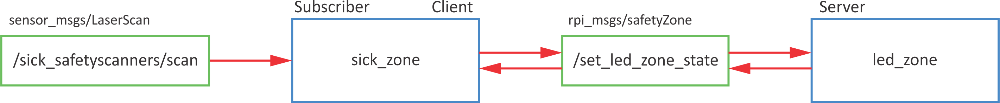

# Custom messages

Topics messages: `.msg`

Service messages: `.srv`

Service message has two parts
```
Request msg
---
Response msg
```

Use of `msg` primitives to define custom messages.

MSG:

- std_msgs
- sensor_msgs
- geometry_msgs
- actionlib_msgs
- ...

SRV:

- std_srvs
- ...

## MSG

We will create new topic message `ledStatus` composed of
```
int64 ledNumber
string ledStatus
```
Create new package `rpi_msgs`
```
cd ~/catkin_ws/src
catkin_create_pkg rpi_msgs rospy std_msgs
```
and build it
```
roscd
cd ..
catkin_make
```
Go to the package and create new folder `msg`:
```
roscd rpi_msgs
mkdir msg
cd msg
```

Create new file `ledStatus.msg`
```
touch ledStatus.msg
code ledStatus.msg
```
and copy the following lines:
``` linenums="1"
int64 ledNumber
string ledStatus
```


Open `package.xml` in `rpi_msgs` package
```
code package.xml
```
and add the following lines
```xml title="package.xml" linenums="58"
<build_depend>message_generation</build_depend>
<exec_depend>message_runtime</exec_depend>
```

Open `CMakeLists.txt` in `rpi_msgs` package
```
code CMakeLists.txt
```
and add the following lines
```txt title="CMakeLists.txt" hl_lines="4" linenums="10"
find_package(catkin REQUIRED COMPONENTS
  rospy
  std_msgs
  message_generation
)
```

```txt title="CMakeLists.txt" hl_lines="4" linenums="49"
# Generate messages in the 'msg' folder
add_message_files(
  FILES
  ledStatus.msg
)
```

```txt title="CMakeLists.txt" linenums="69"
# Generate added messages and services with any dependencies listed here
generate_messages(
  DEPENDENCIES
  std_msgs
)
```

```txt title="CMakeLists.txt" hl_lines="4" linenums="104"
catkin_package(
  # INCLUDE_DIRS include
  # LIBRARIES my_robot_msgs
  CATKIN_DEPENDS rospy std_msgs message_runtime
  # DEPENDS system_lib
)
```

After that do `catkin_make`
```
roscd
cd ..
catkin_make
```

After the build is finish you can check if the message `rpi_msgs/ledStatus` is available
```
rosmsg list |grep rpi
```

## SRV

We will create new service message `safetyZone.srv` composed of
```
int16 zone
---
bool success
string message
```

Go to the package `rpi_msgs`
```
roscd rpi_msgs
```
and create new folder `srv`:
```
mkdir srv
cd msg
```

Create new file `safetyZone.srv`
```
touch safetyZone.srv
code safetyZone.srv
```
and copy the following lines:
``` linenums="1"
int16 zone
---
bool success
string message
```

Open `CMakeLists.txt` in `rpi_msgs` package
```
code CMakeLists.txt
```
and add the following lines
```txt title="CMakeLists.txt" hl_lines="4" linenums="55"
# Generate services in the 'srv' folder
add_service_files(
  FILES
  safetyZone.srv
)
```

After that do the `catkin_make`
```
roscd
cd ..
catkin_make
```

After the build is finish you can check if the service message `rpi_msgs/safetyZone` is available
```
rossrv list |grep rpi
```

## Use of custom MSG and SRV

To use custom messages, you need to do some changes of the `package.html` and the `CMakeLists.txt` of the package where you want to use them (in our case `rpi_feros`)

```xml title="package.html" linenums="61"
<depend>rpi_msgs</depend>
```

```txt title="CMakeLists.txt" linenums="10"
find_package(catkin REQUIRED COMPONENTS
  rospy
  std_msgs
  rpi_msgs
)
```

To include new message in python code add
```python linenums="3"
from rpi_msgs.msg import ledStatus, safetyZone
```


## DEBUG

- `rosmsg list` - list of available messages
- `rosmsg show <msg name>` - show message details

- `rossrv list` - list of available service messages
- `rossrv show <srv msg name>` - show service message details

## Exercise

Turn on LEDs regarding to distance $d$ from safety sensor:

- green: $d$ > 0.4 m
- yellow: 0.4 m > $d$ > 0.2 m
- red: $d$ < 0.2 m



