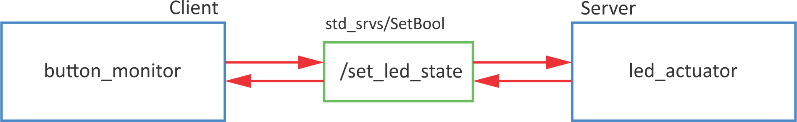

# Services

- Server/client system
- Synchronous operation
- For calculation and quick actions
- One message type for Request, another message type for Response
- A server is only one that can respond to multiple clients

## Example

Turn on LED on button press using interrupts.



## Server

Syntax for service server:
```python
service = rospy.Service('/service_name', msg_type, handle_fcn)
```

Example code:

```python linenums="1" title="led_service_server.py"
#!/usr/bin/env python

import rospy
from std_srvs.srv import SetBool
import RPi.GPIO as GPIO

class ledServer():
    
    def __init__(self):
        # init variables
        self.LED_GPIO = 2
        # set GPIO kot BCM
        GPIO.setmode(GPIO.BCM)
        # set all leds
        for ii in range(2,8):
            # set IO as outputs
            GPIO.setup(ii,GPIO.OUT)
        
        # define service
        # rospy.Service('service_name',varType,callback)
        rospy.Service('/set_led_state', SetBool, self.set_led_status_callback)
        rospy.loginfo("Service server started. Ready to get request.")

        self.ctrl_c = False
        rospy.on_shutdown(self.shutdownhook)

    def set_led_status_callback(self, req): 
        # code that is executed when request is received
        # set LED to req.data
        GPIO.output(self.LED_GPIO, req.data)
        # server response
        return {'success': True, 'message':'Successfully changed LED state.'}

    def resetLed(self):
        # reset all leds
        for ii in range(2,8):
            # turn off all leds
            GPIO.output(ii,False)
        
    def shutdownhook(self):
        # works better than the rospy.is_shutdown()
        # this code is run at ctrl + c

        # clear all settings
        GPIO.cleanup()
        self.ctrl_c = True
            
if __name__ == '__main__':
    # initialise node
    rospy.init_node('led_actuator')
    # initialise class
    led_server = ledServer()
    # reset leds
    led_server.resetLed()
    try:
        # loop
        rospy.spin()
    except rospy.ROSInterruptException:
        pass
```

To test the code run
```
rosrun rpi_feros led_service_server.py 
```
and check the list of services (look for `/set_led_state`)
```
rosservice list
```
Use `rosservice call` to test the server
```
rosservice call /set_led_state "data: True"
rosservice call /set_led_state "data: False" 
```


## Client

Syntax for service proxy (client):
```python linenums="1"
rospy.wait_for_service('/service_name')

try:
  client = rospy.ServiceProxy('/service_name',msg_type)
  ...
except rospy.ServiceException as e:
  rospy.logwarn('Service failed' + str(e))
```

Example:
```python linenums="1" title="button_service_client.py"
#!/usr/bin/env python

import rospy
from std_srvs.srv import SetBool
import RPi.GPIO as GPIO

class buttonClient():
    
    def __init__(self):
        # init variables
        self.BUTTON_GPIO = 11
        self.LED_STATE = False
        # set GPIO kot BCM
        GPIO.setmode(GPIO.BCM)
        # set button GPIO as input
        GPIO.setup(self.BUTTON_GPIO, GPIO.IN)
        # set interrupt
        # GPIO.add_event_detect(gpio_num, edge, callback, bouncetime)
        GPIO.add_event_detect(self.BUTTON_GPIO, GPIO.RISING, callback=self.button_callback, bouncetime=500)

        # define service proxy
        # rospy.ServiceProxy('service_name', varType)
        # wait for service
        rospy.wait_for_service('/set_led_state')
        # define proxy 
        self.set_led_state = rospy.ServiceProxy('/set_led_state', SetBool)
        
        self.ctrl_c = False
        rospy.on_shutdown(self.shutdownhook)

    def button_callback(self, channel):
        # code that is called from interrupt
        # get the button state
        power_on_led = GPIO.input(self.BUTTON_GPIO)

        # change LED state
        self.LED_STATE = not self.LED_STATE

        try:
            # send request, get response
            resp = self.set_led_state(self.LED_STATE)
            # print response
            print(resp)
        except rospy.ServiceException as e:
            # in case of error
            rospy.logwarn(e)
        
    def shutdownhook(self):
        # works better than the rospy.is_shutdown()
        # this code is run at ctrl + c

        # clear all settings
        GPIO.cleanup()
        self.ctrl_c = True
            
if __name__ == '__main__':
    # initialise node
    rospy.init_node('button_monitor')
    # initialise class
    button_client = buttonClient()
    try:
        # loop
        rospy.spin()
    except rospy.ROSInterruptException:
        pass
```

To test, run both server and client in seperate terminals
```
rosrun rpi_feros led_service_server.py 
rosrun rpi_feros button_service_client.py
```
With a button press, LED should turn on and off.

## DEBUG

- `rosservice list` - list of all active services
- `rosservice info <service name>` - information about the selected service
- `rosservice call <service name>` - request to service server from the console

## Exercise

Use buttons to shift active LED left or right.


